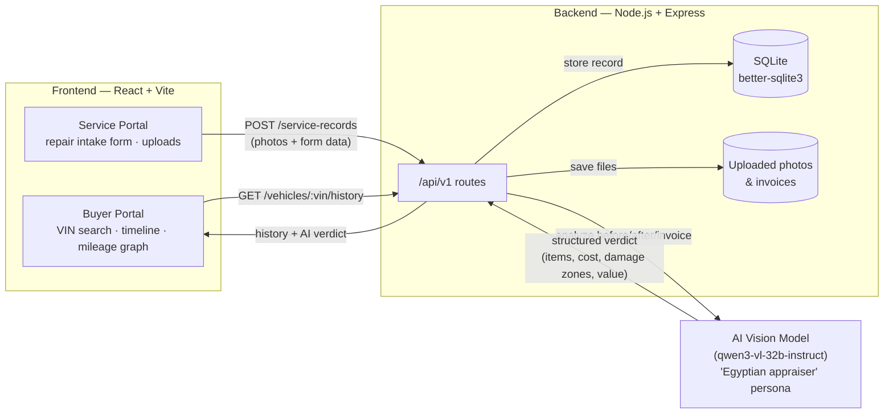

<div align="center">


*Punch in a VIN. Get the truth about the car — mileage history, repair timeline, and an unbiased AI appraisal that protects buyers from fraud.*

[](https://power-shuttle.vercel.app)
[](./LICENSE)
[](./frontend)
[](./backend)

</div>

---

## 📽️ Demo

**Watch the full walkthrough:** [Power Shuttle — Demo Video](https://drive.google.com/file/d/1g8nHpPozcCxwAcz7pB19hO1GoNO65DBd/view?usp=drive_link)

The clip below walks through the two sides of the platform: a **service center** logging a repair (before photo → after photo → invoice) and a **buyer** pulling that car's full history by VIN, including the AI's read on the damage and a fair-value estimate in EGP.

### Resources used in the demo

<p align="center">
  
</p>

<p align="center">
  
</p>

These are exactly the files that get uploaded through the **Service Center** portal for a single repair record — the backend feeds them straight to the AI model, which turns them into the structured timeline entry and damage diagram a buyer sees on the other end.

---

## ✨ What it does

- **VIN lookup for buyers** — enter a 17-character VIN and get a full, chronological history of the vehicle: every logged repair, an odometer/mileage graph over time, and a top-down damage diagram per incident.
- **AI-generated verdict** — an AI vision model plays a "street-smart Egyptian automotive appraiser," reading the before/after photos and the invoice to flag inflated invoices, estimate a fair resale value in EGP, and write a plain-language opinion a non-mechanic can trust.
- **Repair logging for service centers** — a structured intake form (VIN, odometer, service type, insurance claim, notes) with photo/invoice upload, so every repair a shop performs becomes a permanent, tamper-resistant record tied to that VIN.
- **Light/dark mode**, fully responsive, built as small reusable components rather than a hackathon throwaway.

## 🏗️ Architecture



**Frontend** — React (functional components + hooks), plain CSS per component (no Tailwind/CSS-in-JS), served by Vite, deployed on Vercel.
**Backend** — Express REST API, SQLite via `better-sqlite3` for storage, `multer` for photo/invoice uploads, `sharp` for image processing.
**AI layer** — an OpenAI-compatible client calls a vision-capable model to read the before/after photos and invoice, then returns strict structured JSON (repaired items, affected components, damage zones, repair date, estimated value, and a written opinion) that the frontend renders as a timeline and damage diagram.

## 🧩 Tech stack

| Layer | Tech |
|---|---|
| Frontend | React 18, Vite, `lucide-react` |
| Backend | Node.js, Express, `better-sqlite3`, `multer`, `sharp` |
| AI | OpenAI-compatible SDK → vision model, custom appraiser system prompt |
| Deployment | Vercel (frontend) |

## 🚀 Getting started

```bash
git clone https://github.com/youssefelganini/Power_shuttle.git
cd Power_shuttle

# Backend
cd backend
npm install
cp .env.example .env   # add your AI API key + FRONTEND_ORIGIN
npm run dev

# Frontend (in a second terminal)
cd ../frontend
npm install
npm run dev
```

The frontend runs on Vite's dev server (default `http://localhost:5173`) and talks to the backend at `http://localhost:3000/api/v1`.

## 📡 API overview

| Method | Endpoint | Description |
|---|---|---|
| `POST` | `/api/v1/service-records` | Logs a new repair (VIN, odometer, service type, before/after photos, invoice). Kicks off AI analysis in the background. |
| `GET` | `/api/v1/vehicles/:vin/history` | Returns the full history for a VIN: mileage graph data, repair timeline, and the AI's overview/opinion/estimated value. |

## 📁 Project structure

```
Power_shuttle/
├── backend/          # Express API, SQLite schema, AI service
│   ├── routes.js
│   ├── aiService.js
│   ├── database.js
│   └── schema.sql
└── frontend/         # React app
    └── src/
        ├── components/   # Navbar, Landing, BuyerPortal, ServicePortal, CarDashboard, MileageGraph, DamageIndicator...
        └── App.jsx
```

## 🗺️ Roadmap

- [ ] Persistent auth for buyers and service centers
- [ ] Public API rate limiting
- [ ] Multi-language support (Arabic / English)

## 📄 License

MIT — see [LICENSE](./LICENSE).

## 👤 Author

Built by **Youssef Elganini** as a 24-hour hackathon project.
